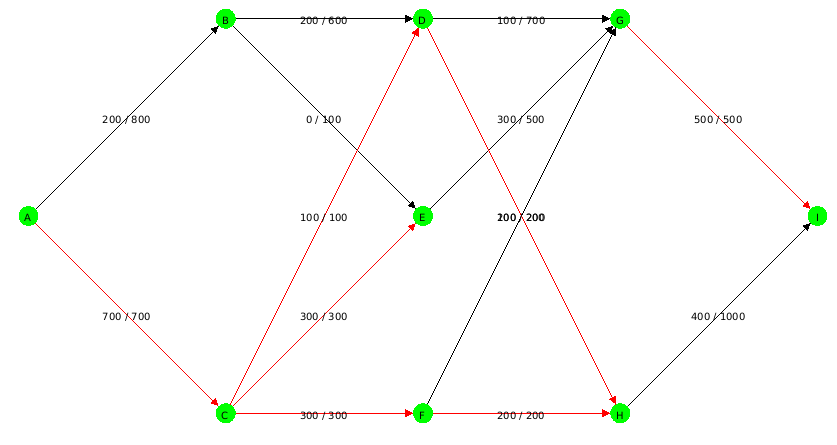
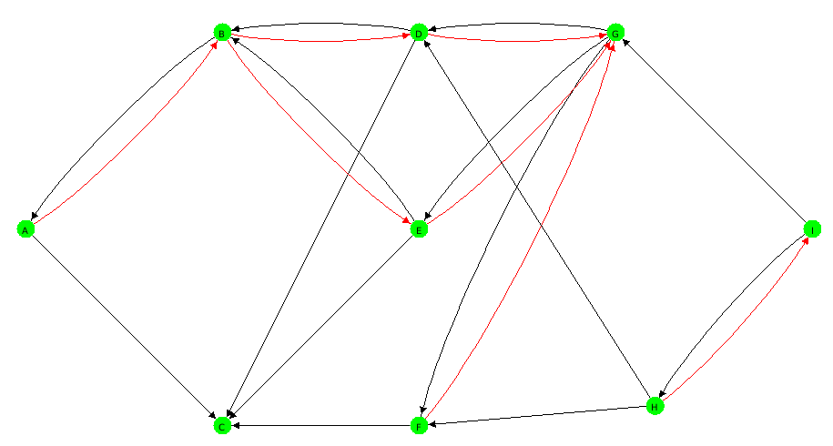

# Tp RI Flots
#Sow Kalidou et Noel Camara

#Réponses aux Questions 
A. Récupération sur Eureka de l’archive maxflow et résolution du problème de flot max.
On a testé sur l’exemple du cours qui est le graphe suivant s1,s3,12,2t,3t
Et après le test le résultat du flot max obtenu est 25 qui est égale au résultat obtenu en cours.

B. Construction du graphe associé au réseau routier
Le fichier DGS associé à ce réseau se trouve dans le dossier src et a pour nom reseauRoutier.dgs et le fichier reseauRoutier2.dgs contient les mises à jours pour la construction des tronçons.

C. Le flot max trouvé à travers l’algorithme maxflow est 900.\
Ce flot est maximal par ce que avec la notion de coupe minimum et de graphe d'ecart, on voit qu'avec le graphe d'ecart on n'a pas de chemin entre A et I, et on peut le prouver aussi avec la coupe minimun associé au graphe 
dont la capacité est egale a valeur du flot.\
La coupe minimum associé à ce graphe est {A,B,C,D,E,F,G} et {H,I} et \
Cap(F,H) + Cap(D,H) + Cap(G,I) = 200 + 200 + 500 = 900 .

- Le graphe

-Le graphe d’écart

Les flèches en noires indiquent le sens dans lequel on peut augmenter la valeur du flot et en
rouges le sens de la diminution.

D. On voit que si on surprime les arcs saturés il serait impossible de trouver un chemin
de A vers I donc c’est les arcs saturés qui créent le lien entre A et I.\
Si l’on décide de construire les 4 tronçons d’autoroutes reliant les villes ACDHI, sachant que
chaque tronçon d’autoroute permettra l’écoulement de 2500 véhicules à l’heure, on aura
intérêt à construire ces tronçons dans l’ordre croissant des flots actuels. On aura ainsi dans
l’ordre : D → H, C → D, A → C,H → I.

E. Pour le premier tronçon on voit que le flot augmente il passe de 900 à 1400 ( flot = 1400).\
Pour le deuxieme tronçon on voit que le flot reste inchangé (flot = 1400).\
Pour le troisième tronçon on voit que le flot augmente il passe de 1400 à 1500 (flot = 1500).\
Pour le quatrième tronçon on voit que le flot augmente il passe de 1500 à 3000 (3000).

Aprés la mise à jours du premier tronçon on trouve comme coupe minimum {A,B,C} et {D,E,F,G,H,I}.\
Aprés la mise à jours du deuxième tronçon on retrouve la même coupe minimum {A,B,C} et {D,E,F,G,H,I}, du faite que le flot n'a pas changé.\
Aprés la mise à jours du troisième tronçon on trouve comme coupe minimum {A,B,C,D,E} et {F,G,H,I}.

